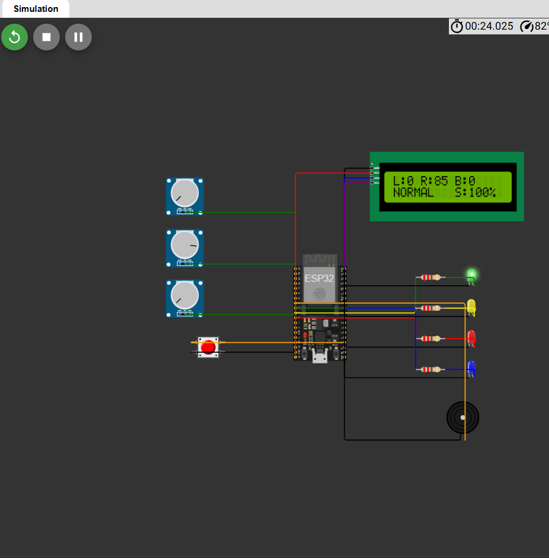
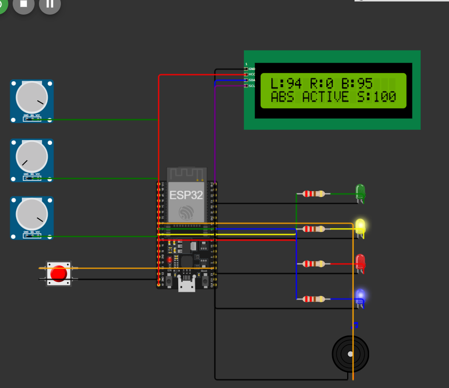
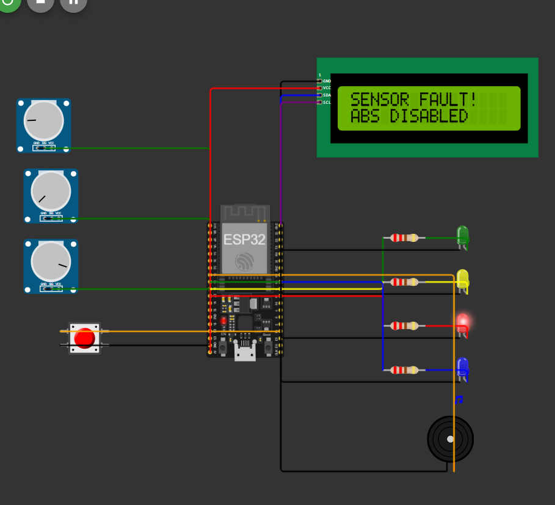

# Virtual ABS ECU

A simulation-based prototype of an automotive **Anti-lock Braking System (ABS)** controller, built on an **ESP32** and simulated in **Wokwi**. It detects wheel slip during braking, activates ABS logic, and handles sensor faults, all with virtual hardware.

**[Run the live simulation on Wokwi](https://wokwi.com/projects/476695993888708609)**

**[Watch the demo video](https://github.com/harsoleaarya-cloud/Virtual-ABS-ECU/raw/main/virtual%20clip.mp4)**

---

## Overview

When a driver brakes hard, a wheel can lock up and skid. An ABS ECU monitors wheel speeds and, when one wheel slows down much faster than the other, reduces brake pressure to keep the wheel rolling. This project models that decision logic and the diagnostic behaviour of a real ECU.

## Features

- Wheel speed and brake pressure inputs (simulated with potentiometers)
- Wheel slip calculation
- ABS activation logic with configurable thresholds
- Three-state machine: `NORMAL`, `ABS_ACTIVE`, `FAULT`
- Sensor fault injection with a push button
- Status shown on a 16x2 LCD, LEDs and a buzzer
- Serial output of `left, right, brake, slip, state` for logging and plotting

## System Block Diagram

```text
Left wheel pot  ─┐
Right wheel pot ─┼─►  ESP32 (ABS ECU)  ─►  Slip calculation  ─►  State machine
Brake pot       ─┤                                                    │
Fault button    ─┘                                  ┌─────────────────┼─────────────────┐
                                                    ▼                 ▼                 ▼
                                                 NORMAL          ABS_ACTIVE           FAULT
                                                    │                 │                 │
                                                    └──────  LCD + LEDs + Buzzer  ──────┘
```

## Hardware (simulated in Wokwi)

| Component | Role |
|---|---|
| ESP32 DevKit | ABS ECU |
| 3 potentiometers | Left wheel speed, right wheel speed, brake pressure |
| 16x2 LCD (I2C) | Status display |
| Green LED | Normal operation |
| Yellow LED | ABS active |
| Red LED | Sensor fault |
| Blue LED | Brake pressure indicator |
| Buzzer | ABS and fault alert |
| Push button | Sensor fault injection |

## Pin Mapping

| Signal | GPIO |
|---|---|
| Left wheel speed | 34 |
| Right wheel speed | 35 |
| Brake pressure | 32 |
| Fault button | 4 |
| Green LED | 25 |
| Yellow LED | 26 |
| Red LED | 27 |
| Blue LED | 18 |
| Buzzer | 33 |
| LCD SDA | 21 |
| LCD SCL | 22 |

## How It Works

Analog inputs (0 to 4095) are scaled to 0 to 100%. The faster wheel is used as the vehicle reference speed, and slip is calculated as:

```text
slip % = (reference speed - slowest wheel speed) / reference speed x 100
```

ABS activates only when **all** of these conditions are true:

| Condition | Threshold |
|---|---|
| Brake pressure | above 20% |
| Reference speed | above 10% |
| Wheel slip | above 20% |

## State Machine

| State | Condition | Outputs |
|---|---|---|
| `NORMAL` | No excessive slip, or not braking | Green LED, LCD shows `NORMAL` |
| `ABS_ACTIVE` | Braking with slip above threshold | Yellow LED, buzzer, LCD shows `ABS ACTIVE` |
| `FAULT` | Fault button toggled | Red LED, buzzer, LCD shows `SENSOR FAULT`, ABS disabled |

## Results

### Normal condition


### ABS active (left wheel 94%, right wheel 0%, brake 95%)


### Sensor fault


## Run It Yourself

1. Open the [Wokwi project](https://wokwi.com/projects/476695993888708609) and press **Play**.
2. Move the potentiometers to change wheel speeds and brake pressure.
3. Click the red button to toggle a sensor fault.

To rebuild it manually, create a new ESP32 project in Wokwi, paste in `diagram.json` and `virtual_abs_ecu.ino` from this repository, and add the `LiquidCrystal I2C` library.

## Repository Contents

| File | Description |
|---|---|
| `virtual_abs_ecu.ino` | ESP32 firmware |
| `diagram.json` | Wokwi circuit definition |
| `normal.png`, `active.png`, `fault.png` | Simulation screenshots |

## Limitations

- Potentiometers stand in for real wheel-speed sensors.
- Slip uses a simplified formula, with the faster wheel as the reference speed.
- Real ABS cycles brake pressure rapidly (hold, release, reapply). This prototype only switches states.

## Future Work

- FreeRTOS tasks for sensing, control and display
- PWM-based brake pressure modulation
- Serial Plotter graphs of speed, slip and ABS state
- Second ECU (dashboard) communicating over CAN

## Tech Stack

C/C++ (Arduino framework), ESP32, Wokwi, I2C
